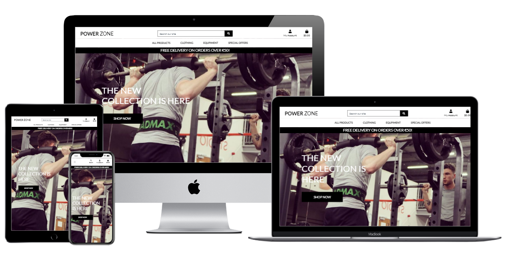
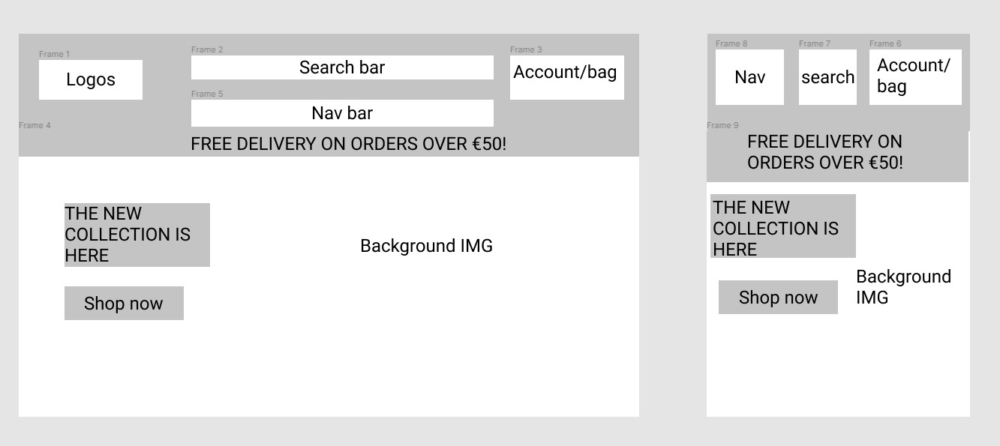
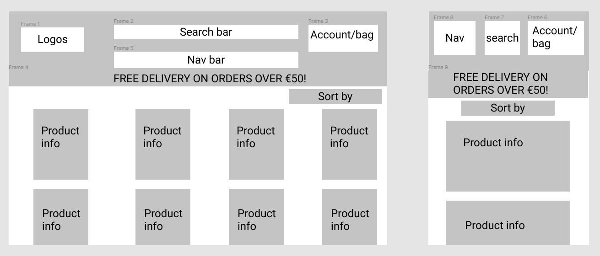
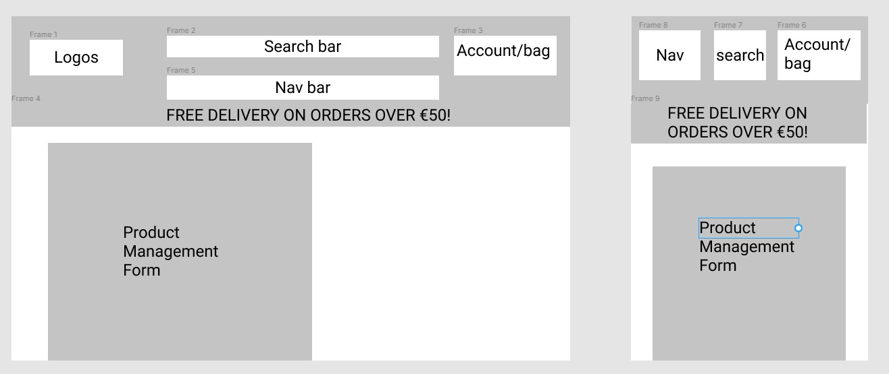
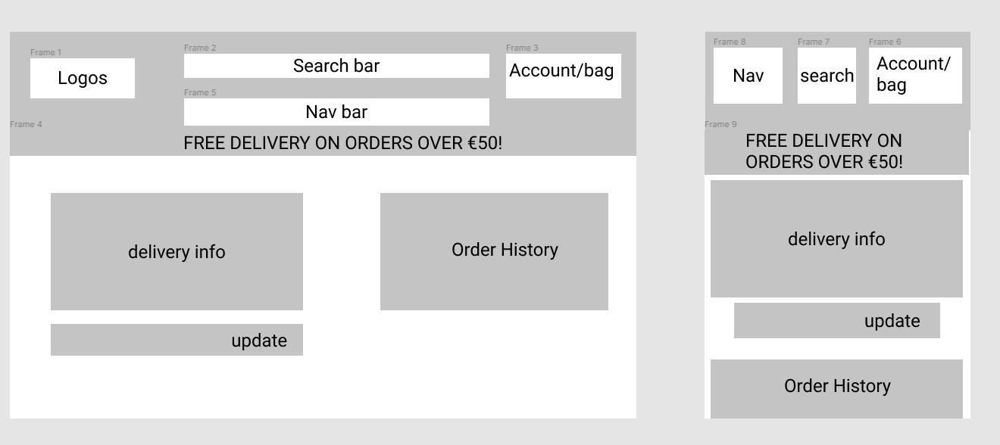
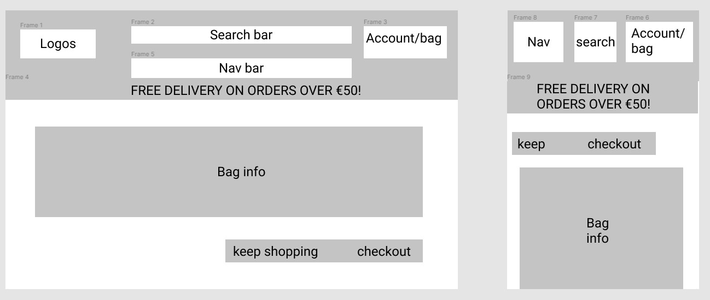
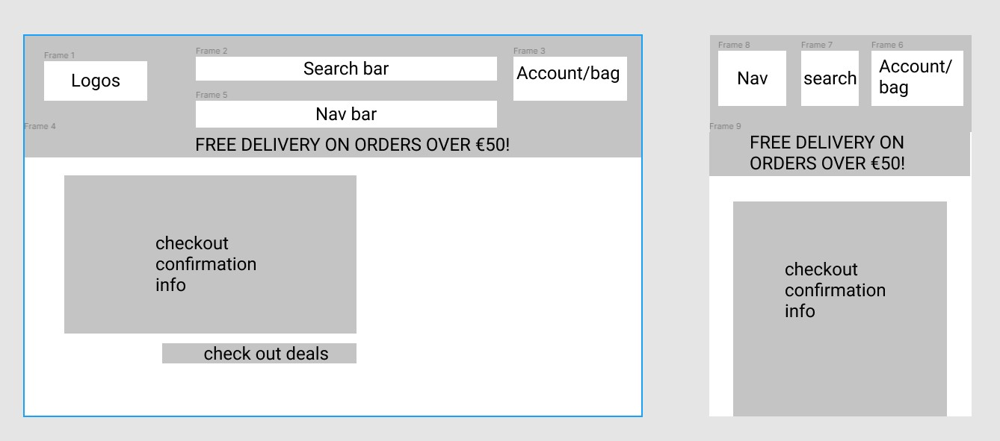
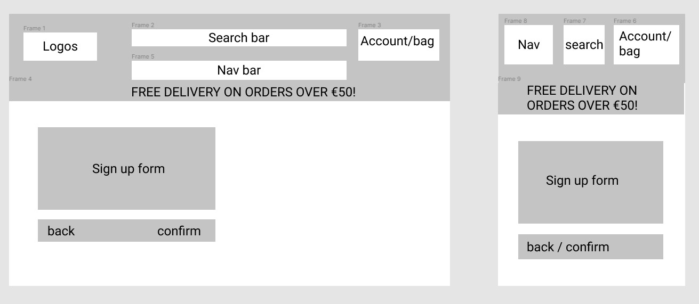
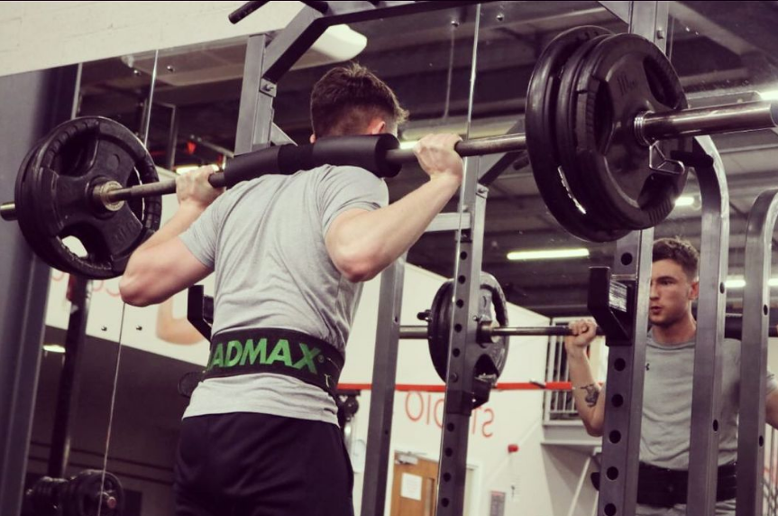
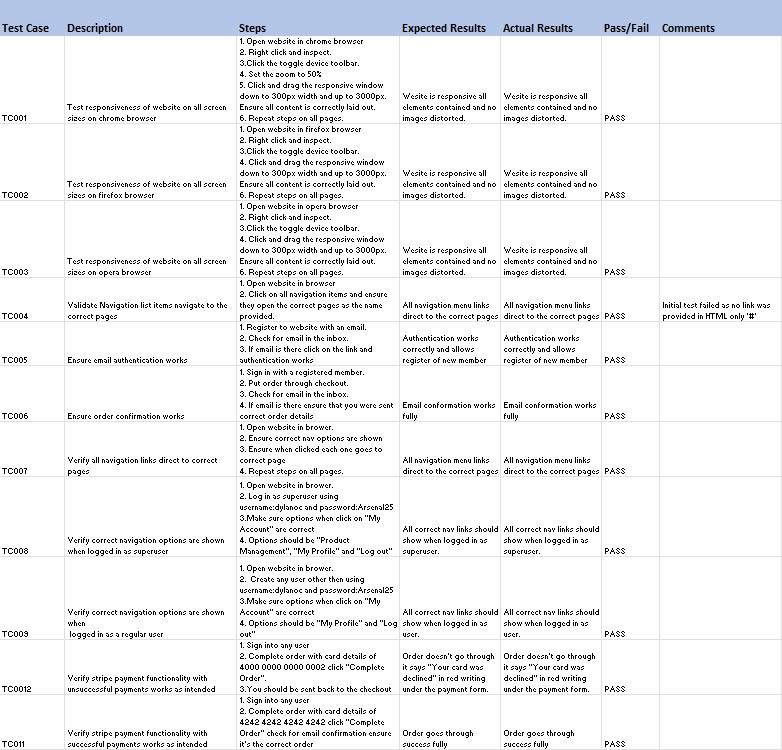

# Power Zone
Power Zone is an ecommerce website where users can purchase athleisure clothing and gym equipment. The user will be able to create an account on the site to provide additional services and improve their user experience. The live website can be found [here](https://power-zone.herokuapp.com/). 

## Table of Contents
* [User Experience Design (UX)](#User-Experience-Design)
    * [The Strategy Plane](#The-Strategy-Plane)
        * [Site Goals](#Site-Goals)
        * [User stories](#User-Stories)
    * [The Scope Plane](#The-Scope-Plane)
    * [The Structure Plane](#The-Structure-Plane)
    * [The Skeleton Plane](#The-Skeleton-Plane)
        * [Wireframes](#Wireframes)
        * [Security](#Security)
    * [The Surface Plane](#The-Surface-Plane)
        * [Design](#Design)
            * [Colour Scheme](#Colour-Scheme)
            * [Typography](#Typography)
            * [Imagery](#Imagery)
- [Features](#Features)
    * [Existing Features](#Existing-Features)
    * [Future Features](#Features-Left-to-Implement)
* [Technologies](#Technologies)
* [Testing](#Testing)
    * [Test Strategy](#Test-Strategy)
    * [Test Results](#Test-Results)
* [Deployment](#Deployment)
    * [Project Creation](#Project-Creation)
    * [Heroku Deployment](#Deployment-To-Heroku)
    * [Run Locally](#Run-Locally)
    * [Fork Project](#Fork-Project)
* [Credits](#Credits)
  * [Content](#Content)
  * [Acknowledgements](#Acknowledgements)

****

## User Experience Design
### **The Strategy Plane**
Power Zone was created by Dylan O’Callaghan for an acquaintance who wanted to see an example store that sells gym clothing and equipment, inspired by his own experience over the last year. Due to the COVID-19 pandemic, there has been a shift in people’s choice of clothes and workout habits. As many people now work from home, the requirement for formal clothing has decreased, while demand for comfortable athleisure and loungewear has risen. In addition, removing commutes from people’s daily lives gave many people more time to work out more frequently. This website provides options for athletes who are serious about their workouts, as well as people who simply enjoy wearing workout clothes while they run errands or work from home.

Dylan decided to also provide a platform for the sale of gym equipment after spending the last four months converting his garage into a home gym. COVID-19 saw the closure of many gyms for long periods of time, forcing people to get creative with their workouts and work out at home. Using his personal experience, Dylan seeks to provide a one-stop shop for all gym clothes and equipment needs. 

The website will allow the user to select their desired size and quantity.

The website will generate an email sent to the user’s desired email account when they place an order. The email will contain an order confirmation, along with order details. A secure checkout function is in place on the website to give the user peace of mind when purchasing their products.

Dylan would like the website to give the user the option to create their own account. An account offers many services that are unavailable to users without an account. It gives users the option to store their personal details and card details which can make future purchases much quicker and easier. It also allows the user to track their order history all in one place so they can avoid searching through emails for previous orders. There is a higher probability that users who create an account will become repeat customers.

#### Site Goals
* To provide an intuitive online shopping environment where users can browse a variety of gym clothes and equipment.
* To allow the users to place an order for products available on the website.
* To offer the user the opportunity to create an account on the website which stores personal details and order history.

#### User stories
* As a user, I want the main purpose of the site to be immediately evident when I enter the site so that I understand its aim from the offset.
* As a user, I want to easily navigate the site so that I can find content quickly.
* As a user, I want the website to be responsive so that I can clearly view the webpages from my mobile device, tablet or desktop.
* As a user, I want to quickly access my shopping bag from all pages on the website. 
* As a user, I want to have the option of creating an account on the website
* As a user with an account, I want to have the option to store personal information to my profile to make repeat purchases quicker and easier.
* As a user with an account, I want to be able to view my order history so I can revisit previous orders.
* As a user, I want to be able to search products listed on the website based on custom criteria.
* As a user, I want to be able to return to the main site without having to use the browser button.

### **The Scope Plane**

**Features planned:**
* Responsive Design - Site should function on mobile, tablet and desktop/laptop devices.
* Mobile and desktop navigations.
* Website information clearly displayed upon entering the home page.
* Search bar to allow users quickly search products on the website.
* Quick access from all pages to user Account and Shopping Basket features.

### **The Structure Plane**

User Story:

> As a user, I want the main purpose of the site to be immediately evident when I enter the site so that I understand its aim from the offset.

Acceptance Criteria:
* Site Logo to be displayed on the main navigation bar on all pages.
* Home Page to display Website Title and information to the user on the purpose of the site. 

Implementation:

* A site logo will be displayed on the main navigation menu. This should be displayed on all webpages.
* A search bar will be available on the home page
* The page headings All Products, Clothing, Equipment and Special Offers are immediately visible on the Home Page.
* An image of someone wearing gym clothes and using gym equipment is the main focus of the Home Page. This gives a visual representation of the purpose of the website, along with the words ‘THE NEW COLLECTION IS HERE’, which clarifies the purpose for the user.

User Story:

> As a user, I want to easily navigate the site so that I can find content quickly.

Acceptance Criteria:
* Navigation menu to be displayed on all pages.
* All navigation links redirect to the correct pages.
* Mobile menu to allow users to navigate the site from a mobile using a collapsible menu.

Implementation:

* A navigation menu will be displayed on all webpages. This will redirect users to the appropriate page when clicked.  
* On smaller devices, the menu will collapse into a hamburger menu to make efficient use of screen space. When clicked, the menu will expand out from the top of the screen displaying all nav items.

The following items will be implemented:
* Home - index.html
* Bag - bag.html
* Checkout - checkout.html
* Checkout Success - checkout_success.html
* Add product - add_product.html
* Edit product - edit_product.html
* Products view - product.html

User Story:

> As a user, I want the website to be responsive so that I can clearly view the webpages from my mobile device, tablet or desktop.

Acceptance Criteria:
* Content should be responsive and display clearly on all devices with no horizontal scroll. 

Implementation:

* All pages tested on all screen sizes to ensure they are all correctly running

User Story:

> As a user, I want to quickly access my shopping bag from all pages on the website.

Acceptance Criteria:
* A shopping basket icon is visible in the top right corner on every page.
* Users can click on the shopping bag icon and be directed to their shopping basket. Here, they can view any is they have added to their shopping bag

User Story:

> As a user, I want to have the option of creating an account on the website. 

Acceptance Criteria:
* A user can create an account my clicking on the ‘My Account’ icon at the top right of all pages.
* A dropdown will give the user to either ‘Register’ or ‘Login’.
* By selecting ‘Register’, the user can create an account.
* Users will then have access to a page called ‘My Profile’, where they can update relevant details.
* Login and Logout functionality to be added.

Implementation:

* A profile page will be implemented that allows the user to update their information. 
* The left side of the profile page will contain the user’s Default Delivery Information, which contains the following fields:
* Mobile Number
* Name
* Address, including space for their Postcode.
* The user can elect to update their information at any time.
* The right side of the page will give the user access to their Order History. 
* Depending on the status of the user, whether they are logged in or logged out, the relevant option will appear when they click the ‘My Account’ option. If they are logged in, they will be given the option to log out. If they are logged out they will be given the option to login.

User Story:

> As a user with an account, I want to have the option to store personal information to my profile to make repeat purchases quicker and easier.

Acceptance Criteria:
* When the user is logged in and purchasing products on the website, their delivery information will autofill at the checkout.

Implementation:

* A user can save and reuse their delievery information.

User Story:

> As a user with an account, I want to be able to view my order history so I can revisit previous orders.

Acceptance Criteria:
* Users with an account will be able to access their order history when they are logged in.

Implementation:
* This information will be available on the right side of the ‘My Profile’ page when the user is logged in to their account.
* The following fields will be population with information:
* Order Number
* Date
* Items
* Order Total

User Story:

> As a user, I want to be able to search products listed on the website based on custom criteria.

Acceptance Criteria:
* Products must be displayed to all users, regardless of user status – whether they have an account or not.
* Users should be able to search for products by name or category.

Implementation:

* A homepage will be implemented that is displayed to all users and is accessible to both users with accounts and guests.

* A search box will be displayed on screen which will allow users to search for produces based on name or category, etc. This will return a filtered, full list of products for the current search criteria.

### **The Skeleton Plane**
#### Wireframes
Home: 
 

Products: 
 

Edit/Add Product: 
 

Profile: 
 

Checkout: 
 

Checkout Success: 
 

Sign In: 
 

#### Security 

Using config variables in heroku, all SECRET access keys are stored safely to prevent unwanted connections to the database.

Django allauth was used to set up user registration and built in decorators allowed restricted access to certain features on the website that are not intended for regular users.

### **The Surface Plane**
### Design

#### Colour Scheme
The header and footer background colour is white. 
The main content background is and image of the person the website is made for working out.  
The heading text and anchor link colour throughout the website is black.  
The main text colour is #555555.  

#### Typography
The headings on all pages use the 'Lato' font while the 
rest of the websites content uses the 'Lato' font.

#### Imagery
Main image is from the person that the site is created for and then rest of images were taken off of nike.com or fitnessequipmentireland.ie

### Differences to Design
The footer ended up being removed as it ruined the flow of the website.

On the product page the edit/delete buttons were moved up to make them more efficent when editing or removing products.

****
## Features

### Existing Features

* CRUD functionality
* Create accounts
* Save information
* Search menu
* Hamburger nav-bar on mobile

### Features Left to Implement
Form refactoring to allow admins to add male and female categories.

Button to recieve email notifications for future and current deal or new items.

****
## Technologies
* [HTML](https://en.wikipedia.org/wiki/HTML)
	* This project uses HTML as the main language used to complete the structure of the Website.
* [CSS](https://en.wikipedia.org/wiki/CSS)
	* This project uses custom written CSS to style the Website.
* [JavaScript](https://en.wikipedia.org/wiki/JavaScript)
    * JS was used to load the toasts and to create the Stripe payments. It was also used for the refresh/scroll functionalty on the product and bag pages.
* [Python](https://www.python.org/)
    * This project was created using Python framework [Django](https://www.djangoproject.com/).
    * Python Modules used (These can be found in the requirements.txt project file):
        * asgiref==3.4.1
        * boto3==1.20.28
        * botocore==1.23.28
        * dj-database-url==0.5.0
        * Django==3.2.8
        * django-allauth==0.45.0
        * django-countries==7.2.1
        * django-crispy-forms==1.13.0
        * django-storages==1.12.3
        * gunicorn==20.1.0
        * jmespath==0.10.0
        * oauthlib==3.1.1
        * Pillow==8.4.0
        * psycopg2-binary==2.9.3
        * PyJWT==2.2.0
        * python3-openid==3.2.0
        * pytz==2021.3
        * requests-oauthlib==1.3.0
        * s3transfer==0.5.0
        * sqlparse==0.4.2
        * stripe==2.64.0

* [Bootstrap](https://getbootstrap.com/)
    * The Bootstrap framework was used through the website for layout and responsiveness.
* [GitHub](https://github.com/)
	* GithHub is the hosting site used to store the source code for the Website.
* [Git](https://git-scm.com/)
	* Git is used as version control software to commit and push code to the GitHub repository where the source code is stored.
* [Heroku](https://dashboard.heroku.com/apps)
    * Heroku was used to deploy the live website.
* [Google Chrome Developer Tools](https://developers.google.com/web/tools/chrome-devtools)
	* Google chromes built in developer tools are used to inspect page elements and help debug issues with the site layout and test different CSS styles.
* [figma Wireframes](https://balsamiq.com/wireframes/)
	* This was used to create wireframes for 'The Skeleton Plane' stage of UX design..
* [Favicon](https://favicon.io/)
    * Favicon.io was used to make the site favicon 
* [Techsini](http://techsini.com/multi-mockup/index.php)
    * Multi Device Website Mockup Generator was used to create the Mock up image in this README.
* [Gitpod](https://code.visualstudio.com/)
    * Gitpod was my choice IDE used to develop the project.
* [AWS](https://aws.amazon.com/free/)
    * AWS S3 Bucket was set up to store static files.
* [Policy Maker](https://policymaker.io/terms-conditions-ready/)
    * Policy maker was used to generate the terms of service.
****
## Testing

### Test Strategy
#### **Summary**
Testing is required on all features and user stories documented in this README. 
All clickable links must redirect to the correct pages.

HTML Code must pass through the [W3C HTML Validator](https://validator.w3.org/#validate_by_uri).

CSS Code must pass through the [W3C CSS Validator](https://jigsaw.w3.org/css-validator/).

JavaScript code must pass through the [JSHint Validator](https://jshint.com/).

Python Code must pass through [PEP8 Validator](http://pep8online.com/)
#### **High Level Test Cases**

 

#### **Access Requirements**
Tester must have access to the Django Admin panel in order to manually verify the insertion of records into the databases.

#### **Regression Testing**
All features previous tested during development in a local environment must be regression 
tested in production on the live website.

#### **Assumptions and Dependencies**
Testing is dependent on the website being deployed live on Heroku.

#### **Out of Scope**
Only test cases listed under High Level Test Cases will be performed as part of this 
testing effort.

****
## Deployment

### Project Creation
To create this project I used the Github along with the Code Institute template.

The following commands were used for version control throughout the project:

`git add <filename>` - This command was used to add files to the staging area before committing.

`git commit -m "commit message explaining the updates"` - This command was used to to commit changes to the local repository.

`git push` - This command is used to push all committed changes to the GitHub repository.

### Deployment to Heroku

**Create application:**
1. Navigate to Heroku.com and login.
1. Click on the new button.
1. Select create new app.
1. Enter the app name.
1. Select region.

**Set up connection to Github Repository:**

1. Click the deploy tab and select GitHub - Connect to GitHub.
1. A prompt to find a github repository to connect to will then be displayed.
1. Enter the repository name for the project and click search.
1. Once the repo has been found, click the connect button.

**Set environment variables:**

1. Click on the settings tab and then click reveal config vars.
1. Variables added: 
    * AWS_ACCESS_KEY_ID
    * AWS_SECRET_ACCESS_KEY
    * DATABASE_URL
    * DISABLE_COLLECTSTATIC
    * EMAIL_HOST_PASS
    * EMAIL_HOST_USER
    * SECRET_KEY
    * STRIPE_PUBLIC_KEY
    * STRIPE_SECRET_KEY
    * STRIPE_WH_SECRET
    * USE_AWS

*Please note the values for these variables depend on your own personal set up. For security reasons I will not add the values here.*

**Enable automatic deployment:**
1. Click the Deploy tab
1. In the Automatic deploys section, choose the branch you want to deploy from then click Enable Automation Deploys.

### Run Locally

1. Navigate to the GitHub [Repository](https://github.com/dylanocallaghan/MS4).
1. Click the Code drop down menu.
1. Either Download the ZIP file, unpackage locally and open with IDE (This route ends here) OR Copy Git URL from the HTTPS dialogue box.
1. Open your developement editor of choice and open a terminal window in a directory of your choice.
1. Use the `git clone` command in terminal followed by the copied git URL.
1. A clone of the project will be created locally on your machine.

Once the project has been loaded into an IDE of choice, run the following command in the shell to install all the required packages:
`pip install -r requirements.txt`

### Fork Project 

Most commonly, forks are used to either propose changes to someone else's project or to use someone else's project as a starting point 
for your own idea. - Definition from [Github Docs](https://docs.github.com/en/free-pro-team@latest/github/getting-started-with-github/fork-a-repo).

1. Navigate to the GitHub Repository you want to fork.
1. On the top right of the page under the header, click the fork button.
    
    
1. This will create a duplicate of the full project in your GitHub Repository.

****
## Credits

### Code

As my Project was for someone else I created the gym store with the help of a mini-project called "Boutique-Ado" in a Full Stack Framworks module from Code Institute. 

The Stripe payment was coded by following a [tutorial](https://testdriven.io/blog/django-stripe-subscriptions/). This included the python 
code and the javascript. 

### Acknowledgements

I'd like to give special thanks to the the following people for their help with my project:

* Helpful tutors who helped me deploy my project on Heroku and connect a real email.
* Helpful slack users who responded to any queries that I had throughout the project e.g. issues implementing the collapsible menu from materialize.
* My mentor Spencer for reviewing my project and confirming he was happy with my work.
* Helpful modules on the Code Institute Software Development course where it help me with a bit of the project coding